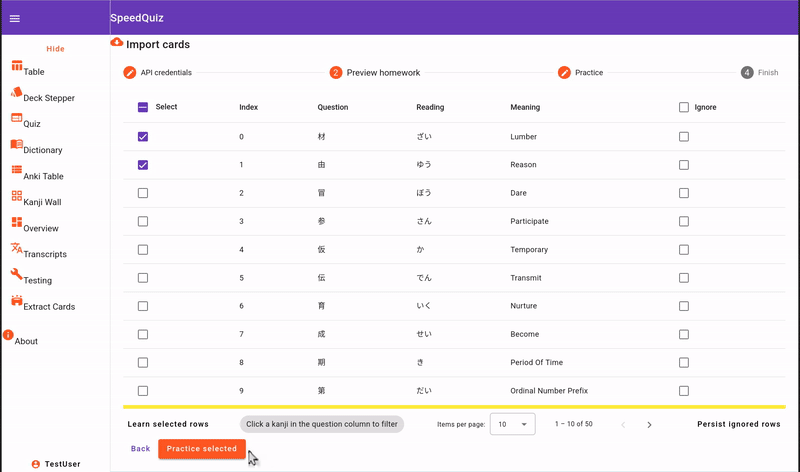

# SpeedQuiz — Japanese Learning Platform

A **Fullstack Web Application** designed for efficient Japanese language study. Originally built as a personal learning tool to master Kanji, this
project serves as a technical showcase for modern web technologies and complex UI logic.

I developed this to bridge the gap between my professional experience in the **Automotive Industry** and modern web development patterns, focusing on
high-performance data handling and interactive canvas elements.

> **Note:** This site is a private project with restricted access.

## Screenshot



## Tech Stack

| Layer | Technology |
|---|---|
| Frontend | Angular 19, Angular Material, RxJS |
| Backend | Spring Boot 3.4 (Java 21), Spring Data JPA, Lombok |
| NLP Service | Python FastAPI, MeCab (Japanese morphological analysis) |
| Database | PostgreSQL 16, SQLite (read-only Anki import) |
| Migrations | Flyway |
| API Contract | OpenAPI 3.0 with code generation |
| Infrastructure | Docker Compose, nginx (reverse proxy) |

## Architecture

```
┌──────────┐     ┌───────────────┐     ┌──────────────┐
│  Browser │────▶│  nginx (:80)  │────▶│  Angular SPA │
└──────────┘     └───────┬───────┘     └──────────────┘
                         │ /api/*
                         ▼
                 ┌───────────────┐     ┌──────────────┐
                 │ Spring Boot   │────▶│ PostgreSQL   │
                 │    (:8080)    │     │   (:5432)    │
                 └───────┬───────┘     └──────────────┘
                         │                    
                         │             ┌──────────────┐
                         │────────────▶│ SQLite (R/O) │
                         │             │  Anki export │
                         │             └──────────────┘
                         │ /parse
                         ▼
                 ┌───────────────┐
                 │ FastAPI+MeCab │
                 │    (:8000)    │
                 └───────────────┘
```

Five containers orchestrated via Docker Compose. nginx serves the Angular SPA and proxies API requests to Spring Boot. The Python microservice handles
Japanese text segmentation via MeCab and is called server-to-server from the backend.

## Features

**Quiz Engine** — Configurable flashcard decks with pluggable property types (question, answer, hint, image, audio, hiragana, SVG). Answer validation
uses Levenshtein distance for fuzzy matching and a custom romaji-to-hiragana converter so you can type answers in either script.

**Kanji Wall & Stroke Order** — Visual grid of kanji with interactive SVG stroke order diagrams sourced from KanjiVG. Click any kanji to see readings,
meanings, and animated writing order.

**Anki Import** — Reads Anki's SQLite `collection.db` directly (read-only mount), parses the internal field format into structured cards, and renders
them in a paginated table with row-level ignore/restore.

**Japanese Dictionary** — Backed by JMDict_e.xml with MeCab-powered text segmentation. Paste a Japanese sentence and get it broken down into
individual words with dictionary lookups.

**WaniKani Integration** — Connects to the WaniKani API to pull assignments and subjects, with token verification and a dev-cache mode for offline
development.

**Stream Transcript Cards** — Upload transcripts (e.g. from Japanese streams), store them with deduplication handling, and turn them into study
material.

**Deck Creator** — Stepper-based UI for building custom flashcard decks with arbitrary properties. Decks are stored as JSONB in PostgreSQL.

**Session System** — Lightweight, passwordless sessions. Users pick a display name, get a UUID token stored in localStorage, and can export/import
their profile as JSON for backup.

## Getting Started

```
Clone the repository
Copy the environment file: `cp .env.example .env`
Run `docker compose up --build`
```

The app will be available at `http://localhost:4200?token=portfolio`. The backend runs on `:8080`, but nginx handles the routing so you shouldn't need to access it
directly.

**Local development (without Docker):**

```bash
# Backend (needs PostgreSQL running on :5433)
cd BackendSpeed
./mvnw spring-boot:run -Dspring-boot.run.profiles=local

# Frontend
cd FrontendQuiz
npm install
ng serve
```

## Project Structure

```
├── BackendSpeed/          Spring Boot backend (Java 21)
│   └── src/main/java/com/japangular/quizzingbydoing/backendspeed/
│       ├── config/                  DataSource & CORS configuration
│       ├── externalClients/         WaniKani API client
│       ├── features/
│       │   ├── ankiSqliteToCsvParsing/   Anki SQLite → structured cards
│       │   ├── extractCardsFromUrl/       URL-based card extraction
│       │   ├── jm_dict_e/                JMDict dictionary service
│       │   ├── kanjiDetails/             Kanji detail lookup
│       │   ├── kanjidict/                Kanji search + MeCab integration
│       │   ├── quizFrontend/             Quiz deck API
│       │   └── transcriptCards/          Transcript storage & retrieval
│       └── session/                 Lightweight session management
├── FrontendQuiz/          Angular 19 SPA
│   └── src/app/
│       ├── features/                Feature components (quiz, dict, kanji, etc.)
│       ├── layout/                  Side-nav, footer, about
│       ├── services/                Shared state & API services
│       ├── user-store-management/   Session, profile, token interceptor
│       └── widgets/                 Reusable UI components
├── PythonDict/            FastAPI microservice for MeCab
├── compose.yaml           Docker Compose orchestration
├── nginx.conf             Reverse proxy configuration
└── api.yaml               OpenAPI 3.0 contract
```

## Credits

### KanjiVG

This project includes kanji stroke order diagrams sourced from the [KanjiVG project](https://github.com/KanjiVG/kanjivg), licensed
under [Creative Commons Attribution-ShareAlike 3.0](https://creativecommons.org/licenses/by-sa/3.0/).

Original author: Ulrich Apel
KanjiVG Website: http://kanjivg.tagaini.net

### Fonts

This project uses the KanjiStrokeOrders font, licensed under the BSD-style license. The stroke order diagrams are copyrighted by Ulrich Apel and the
Wadoku and AAAA projects. For more information, please refer to the [KanjiStrokeOrders font page](http://sites.google.com/site/nihilistorguk/).
