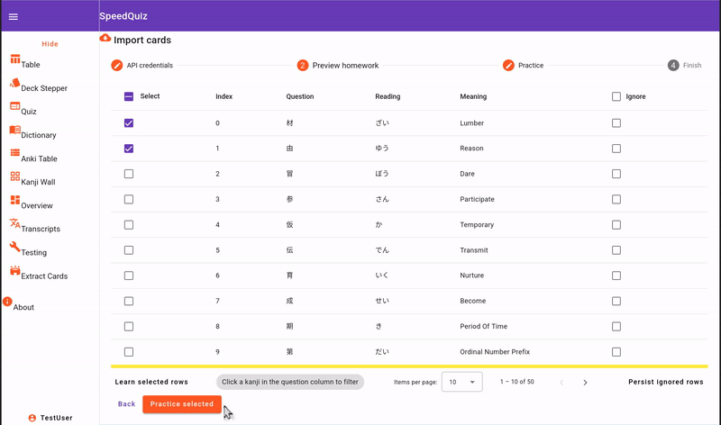

# SpeedQuiz — Japanese Learning Platform

A fullstack web application I built to move from the **automotive industry** into
modern web development, using my own Japanese study as the problem domain. The
focus is on patterns that hold up at scale: a single API contract enforced on
both sides, adapter-based source integration, and per-property validation
strategies.

> **Note:** This site is a private project.

## Screenshot



## Tech Stack

| Layer          | Technology                                                    |
|----------------|---------------------------------------------------------------|
| Frontend       | Angular 19, Angular Material, RxJS                            |
| Backend        | Spring Boot 3.4 (Java 21), Spring Data JPA, HikariCP, Lombok  |
| NLP Service    | Python FastAPI, MeCab (Japanese morphological analysis)       |
| Database       | PostgreSQL 16, SQLite (read-only Anki import)                 |
| Migrations     | Flyway                                                        |
| API Contract   | OpenAPI 3.0 with code generation (shared by frontend/backend) |
| Infrastructure | Docker Compose, nginx reverse proxy, multi-stage builds       |

## Architecture

```
┌──────────┐     ┌───────────────┐     ┌──────────────┐
│  Browser │────▶│  nginx (:80)  │────▶│  Angular SPA │
└──────────┘     └───────┬───────┘     └──────────────┘
                         │ /api/*
                         ▼
                 ┌───────────────┐     ┌──────────────┐
                 │ Spring Boot   │────▶│ PostgreSQL   │
                 │    (:8080)    │     │   (:5432)    │
                 └───────┬───────┘     └──────────────┘
                         │
                         │             ┌──────────────┐
                         │────────────▶│ SQLite (R/O) │
                         │             │  Anki export │
                         │             └──────────────┘
                         │ /parse
                         ▼
                 ┌───────────────┐
                 │ FastAPI+MeCab │
                 │    (:8000)    │
                 └───────────────┘
```

Five containers orchestrated via Docker Compose. Nginx serves the Angular SPA
and proxies API requests to Spring Boot. The Python microservice handles
Japanese text segmentation via MeCab and is called server-to-server from the
backend.

## Design Decisions

**API-First Contract** — A single `api.yaml` OpenAPI spec is the source of
truth. The Maven build generates Spring controller interfaces via
`openapi-generator-maven-plugin`; the frontend Dockerfile generates a
TypeScript-Angular HTTP client from the same spec. Controllers implement the
generated interfaces, so the API contract is enforced at compile time on both
sides.

**Adapter Pattern for Deck Sources** — Cards come from three sources:
Anki SQLite, HTML resource files (JLPT lists from Tanos), and user-created
PostgreSQL decks. Each source has an adapter that translates its native format
into a common `DeckProvider` / `DeckContent` interface, and
`DeckRegistryService` acts as a facade that unifies all three behind one API.
Further providers could fit the same shape.

**Dual Datasource Strategy** — PostgreSQL (via HikariCP connection pool) for
application data, SQLite (read-only, via JdbcTemplate) for Anki import. JPA
repositories are used for entities with typed columns (Kanji, UserTableState,
Transcripts). JdbcTemplate is used for tables with jsonb blobs or raw SQL needs
(Deck, CardProgress, Session).

**Global Error Handling** — A single `@RestControllerAdvice` handler maps all
exceptions to a consistent `ApiError` JSON response with status, error type,
message, and timestamp. Custom exceptions map to appropriate HTTP status codes.
No stack traces leak to the client.

**Per-Property Quiz Validation** — Each card property (question, answer, hint,
hiragana, …) declares its type, and the frontend selects a validator function
per answer slot from that type. Hiragana fields convert romaji input to kana on
the fly and require an exact match; plain answer fields use Levenshtein
distance for fuzzy matching. A single card can mix strict kana matching for the
reading slot with fuzzy English matching for the meaning slot.

**Route-Level Dependency Injection** — Angular's route `providers` array swaps
the data source implementation per context. The Anki table route injects
`BackendSourceService` (HTTP calls), while the URL-import route injects
`JsonSourceService` (in-memory). Both extend the same `AnkiSourceService`
abstract class, so components are unaware of the data origin.

**Layered Access Control** — Access control lives at the edge, not in the SPA.
The frontend "access gate" (`?token=…`) only selects a site mode
(portfolio vs. invited-user) and is deliberately *not* a security boundary —
its tokens ship in the JS bundle. Real access control in production is mutual
TLS at the host nginx: requests without a valid client certificate are
rejected with 403 before they reach the application. Session tokens then scope
*data ownership* (whose decks, whose progress), not *access*.

## Security Model

The deployment assumes a small, personally invited user group — it is
intentionally not designed for open registration.

**Host hardening (Ansible `bootstrap` role)** — SSH key-only authentication
(passwords and interactive login disabled), UFW with default-deny incoming
(only 22/80/443 open), fail2ban, and unattended security upgrades. The app
runs under an unprivileged service user, not root.

**Network topology** — Only the host nginx is exposed. All container ports
published for local development are stripped in production via a Compose
override; the container nginx binds to `127.0.0.1` and everything else stays
on the internal Docker network.

**Transport & access** — TLS via Let's Encrypt with automated renewal
(certbot webroot challenge, systemd timer). Application traffic additionally
requires an mTLS client certificate issued from a project CA. The
`/api/actuator/health` endpoint is exempt so uptime monitoring works without
a certificate.

**Application layer** — Passwordless UUID sessions (a deliberate tradeoff for
a trusted handful of users behind mTLS). Display names are validated against a
strict allow-list pattern and HTML-escaped server-side. Transcript uploads are
deduplicated server-side. Errors return a sanitized `ApiError`, never stack
traces.

**Secrets** — Database credentials, domain, and CORS origins live in an
`ansible-vault` encrypted vars file and are rendered into `.env` on the host
at deploy time. Nothing secret is committed.

## Features

**Quiz Engine** — Configurable flashcard decks with pluggable property types
(question, answer, hint, image, audio, hiragana, SVG). Answer validation uses
Levenshtein distance for fuzzy matching and a custom romaji-to-hiragana
converter so you can type answers in either script.

**Kanji Wall & Stroke Order** — Visual grid of kanji with interactive SVG
stroke order diagrams sourced from KanjiVG. Click any kanji to see readings,
meanings, and animated writing order.

**Anki Import** — Reads Anki's SQLite `collection.db` directly (read-only
mount), parses the internal field format into structured cards, and renders
them in a paginated table with row-level ignore/restore.

**Japanese Dictionary** — Backed by JMDict_e.xml (~213k entries, indexed at
startup) with MeCab-powered text segmentation. Paste a Japanese sentence and
get it broken down into individual words with dictionary lookups. A custom
Spring Boot health indicator reports dictionary readiness, and deploys are
gated on it.

**Stream Transcript Cards** — Upload Japanese livestream subtitles, store them
with deduplication detection (409 Conflict on duplicate title + vtuber), and
turn them into study material. Transcripts are used privately for language
study within the invited group and are not redistributed; rights to the
underlying streams remain with their creators.

**Deck Creator** — Stepper-based UI for building custom flashcard decks with
arbitrary properties. Decks are stored as JSONB in PostgreSQL.

**Extract Cards from URL/Paste** — Paste tab-separated or newline-grouped
content (e.g. from spreadsheets or WaniKani level pages), have columns
auto-classified as question/answer/hiragana, preview, and save as a user deck.

**Session System** — Lightweight, passwordless sessions. Users pick a display
name (validated and sanitized server-side), get a UUID token stored in
localStorage, and can export/import their profile as HMAC-signed JSON so a
profile survives a cleared browser or a device switch.

## Testing

**End-to-end (Playwright)** — A page-object-model suite under `e2e/` covers
the access gate, session provisioning, quiz flow, dictionary (including error
states), navigation, input debouncing, and responsive layout. A mock backend
(`e2e/mocks/`) allows UI tests to run without the full container stack.

```bash
cd e2e
npm install
npx playwright test
```

**Backend** — MockMvc controller tests (session provisioning/validation edge
cases, transcript deduplication) and unit tests for the HTML table import
pipeline.

```bash
cd BackendSpeed
./mvnw test
```

## Deployment

Provisioning and releases are fully automated with Ansible under `deploy/`:

```bash
cd deploy
ansible-galaxy collection install -r requirements.yml
ansible-playbook site.yml --ask-vault-pass     # full provisioning + first deploy
ansible-playbook deploy.yml --ask-vault-pass   # routine release (app role only)
```

`site.yml` runs four roles: **bootstrap** (users, SSH hardening, UFW,
fail2ban, unattended-upgrades), **docker** (Engine + Compose v2 from the
upstream repo), **nginx** (host reverse proxy, certbot with webroot renewal,
mTLS client CA), and **speedquiz** (clone repo, render `.env` and the
production Compose override from vault variables, `docker compose up`).

Releases are health-gated: the playbook takes a pre-deploy `pg_dump` backup
(pruned after 30 days), waits for the actuator health endpoint to report `UP`
— including the dictionary index — and prunes dangling images and stale build
cache. Both playbooks are idempotent and safe to re-run.

## Kubernetes

`k8s/` contains a port of the Compose stack to Kubernetes manifests for a
local cluster: namespace, Secret/ConfigMap for configuration, a PostgreSQL
StatefulSet with a persistent volume, Deployments for backend / frontend /
MeCab service with startup, readiness, and liveness probes plus resource
requests and limits, and an Ingress at `speedquiz.local`. Images are built
locally (`imagePullPolicy: Never`). This exists as a learning exercise and a
migration path; the production deployment currently runs on Docker Compose.

## Getting Started

```bash
git clone <repository-url>
cp .env.example .env
docker compose up --build
```

The app is available at `http://localhost:4200?token=portfolio`. The
`?token=portfolio` query parameter selects portfolio mode at the access gate —
it is a UI mode switch, not an authentication mechanism (production access is
enforced separately via mTLS at the reverse proxy). The backend runs on
`:8080`; nginx proxies all API traffic, so you don't need to hit it directly.

**Local development (without Docker):**

```bash
# Backend (needs PostgreSQL running on :5433)
cd BackendSpeed
./mvnw spring-boot:run -Dspring-boot.run.profiles=local

# Frontend
cd FrontendQuiz
npm install
ng serve
```

## Project Structure

```
├── BackendSpeed/              Spring Boot backend (Java 21)
│   └── src/main/java/.../backendspeed/
│       ├── config/                    Global exception handler, HikariCP datasource, CORS
│       ├── deckPersistence/           User-deck persistence port adapter
│       ├── frontendProviders/         REST controllers (implement generated OpenAPI interfaces)
│       ├── infrastructure/
│       │   ├── jm_dict_e/             JMDict XML dictionary (model, service, health indicator)
│       │   └── kanjidict/             Kanji search, MeCab client, import service
│       ├── persistence/
│       │   ├── deck/                  Deck storage (JdbcTemplate + jsonb)
│       │   ├── progress/              Card progress tracking (JdbcTemplate)
│       │   └── session/               Session management (JdbcTemplate)
│       ├── quizFeatures/              Deck registry facade, browsing, DeckProvider interface
│       ├── sourceFeatures/
│       │   ├── adapters/              AnkiDeckAdapter, UserDeckAdapter
│       │   ├── ankiParsing/           SQLite → CSV → structured cards pipeline
│       │   ├── htmlTableImport/       HTML table → deck importer (JLPT lists)
│       │   └── transcriptCards/       Transcript storage, deduplication, mapping
│       └── utils/                     HTML parser, JSON batch importer
├── FrontendQuiz/              Angular 19 SPA
│   └── src/app/
│       ├── features/
│       │   ├── anki-table/            Anki card browser (abstract data source pattern)
│       │   ├── deck-bar/              Deck switcher bar
│       │   ├── deck-shelf/            Deck overview with grouped accordion UI
│       │   ├── dict/                  Dictionary + MeCab tokenizer UI
│       │   ├── dynamic-card-creator/  Stepper-based deck builder
│       │   ├── extract-cards-from-url/ Paste / URL → deck stepper
│       │   ├── kanji-wall/            Visual kanji grid with stroke order
│       │   ├── quiz/                  Quiz engine (board, answer slots, validation strategies)
│       │   └── transcription-translation/ Transcript table + upload
│       ├── interceptor/               HTTP logger / error interceptors
│       ├── interfaces/                DI tokens for API services
│       ├── layout/                    Side-nav, footer, about page
│       ├── services/                  Shared state & API services
│       ├── site-mode/                 Access gate (site mode selection)
│       ├── store/                     NgRx Signals deck store
│       ├── user-store-management/     Session, profile, token interceptor
│       └── widgets/                   Reusable components (modals, stroke order, upload)
├── PythonDict/                FastAPI microservice for MeCab tokenization
├── e2e/                       Playwright E2E suite (page objects, mocks, specs)
├── deploy/                    Ansible provisioning & release playbooks (4 roles)
├── k8s/                       Kubernetes manifests (local cluster port)
├── compose.yaml               Docker Compose orchestration
├── nginx.conf                 Container reverse proxy configuration
└── api.yaml                   OpenAPI 3.0 contract (shared source of truth)
```

## Credits

### JMdict

Japanese-English dictionary data from the [JMdict-EDICT Dictionary Project](https://www.edrdg.org/wiki/index.php/JMdict-EDICT_Dictionary_Project), the property of the Electronic Dictionary Research and Development Group (EDRDG), used in accordance with the [EDRDG License](https://www.edrdg.org/edrdg/licence.html) (Creative Commons Attribution-ShareAlike).

### KanjiVG

This project includes kanji stroke order diagrams sourced from the
[KanjiVG project](https://github.com/KanjiVG/kanjivg), licensed under
[Creative Commons Attribution-ShareAlike 3.0](https://creativecommons.org/licenses/by-sa/3.0/).

Original author: Ulrich Apel
KanjiVG website: http://kanjivg.tagaini.net

### Fonts

This project uses the KanjiStrokeOrders font, copyrighted by Ulrich Apel, the AAAA project, and the Wadoku project. See [LICENSE-KanjiStrokeOrders.txt](./LICENSE-KanjiStrokeOrders.txt) for the full BSD 3-Clause License text. For more information, see the [KanjiStrokeOrders font page](http://sites.google.com/site/nihilistorguk/).
